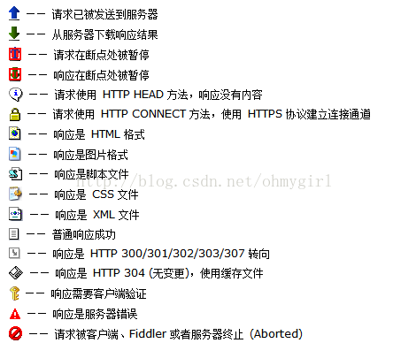

#Fiddler
######Fiddler抓包原理示意图
</img>
> 使用Fiddler抓包，使用的是中间代理的形式。客户端使用使用fiddler代理，向网站进行请求，请求后返回值给fiddler，再返回给客户端；
> >#####注意：
> > >Fiddler是以代理web服务器的形式工作的，它使用的代理地址是：127.0.0.1，端口：8888。当Fiddler退出时它户izidong注销，不会影响其他程序，但是如果fiddler非正常退出，这个时候fiddler没有自动注销，会造成网页无法访问，重启下fiddler就可以了；

###配置
> 打开Fiddler->Tool -> Fiddler Options -> HTTPS
> 选中'Decrpt HTTPS traffic',使fiddler能截获HTTPS请求（第一次会弹出证书安装提示，如果没有提示，勾选Actions->Trust Root Certificate.
> 另外，如果监听的程序访问的HTTPS站点是使用的不可信的证书，则把下方的'Ignore server certificate errors(unsafe)勾选；
> 使用Actions->open windows certificate Manager查看证书；

###手机抓包配置
>fiddler监听端口默认是8888，可以在tool->fiddler Options -> Connerctions选项卡中修改Fiddler listens on port用于修改本地代理端口，勾选'allow remote computersto connect',运行远程设备链接。
> 去掉'Act assystem proxy on startup'，用于减少干扰
#####手机端设置
步骤：
> 1. 确定手机和电脑在同一局域网；
> 2. 将Fiddler代理服务器的证书导入到手机才能抓app的包；
>> 打开浏览器，在地址栏中输入代理服务器的IP和端口（即电脑的IP，和fiddler的端口),会看到fiddler提供的页面，然后确定安装即可；
3. 在手机中，打开wifi设置页面，选择要链接的wifi，设置代理，选择手动，（代理服务器主机名为PC的IP，代理服务器端口设为，fiddler上配置的端口。

###fiddler的使用
> 1. 视图功能区域
> 会话：一次请求和一次响应就是一个会话
> - 工具栏区
> > 第一个是给会话添加备注信息
> 第二个（replay）是重新加载当前会话
> 第三个（叉叉）删除会话选项
> 第四个（go)放行（和断点对应）
> 第五个（stream)响应模式。（当fiddler那倒远程的response后缓存起来一次响应给客户端还是以stream的方式直接响应）
> 第六个（decode）解码，有些请求是被编码的，点击该按钮可以根据响应的编码格式自动解码
> 。。。（Find）查找会话
> 。。。（save）保存会话
> 。。。截屏按钮。（截屏后，会以会话的方式返回一截图)
> - 会话列表
> 标题栏选项
> > * [#]--HTTP Request的顺序，从1开始，安卓页面加载请求的顺序递增。
> > >[#]一栏的的标识：
> </img> 
> > * [result]--HTTP响应的状态
> > * [Protocol] --请求使用的协议（如HTTP/HTTPS/FTP）
> > * [Host]--请求地址的域名
> > * [URL]--请求的服务器路径和文件名，也包括GET参数
> > * [BODY]--请求的大小，以byte为单位
> > * [Caching]--请求的缓存过期时间或缓存控制header等值
> > * [Content-Type] --请求响应的类型(Content-Type)
> > * [Process]--发出此请求的windows进程及进程ID
> > * [Comments]--用户通过脚本或者邮件菜单给此session增加的备注
> > * [Custom]--用户可以通过脚本设置的自定义值
> - 右侧状态栏
> > * **Statisti**:显示关于http请求的性能和其它数据；
> > * **Inspectors**:提供headers,textview,hexview,raw等多种方式查看单条http的请求报文的信息 ，分为上下两个部分，上半部分是请求部分，下半部分是响应头部分。
> > > + **ImageView标签**:JPG格式使用该标签，可以看到图片。（选择Content-Type是image/jpeg的会话,点击ImageView)
> > > + **TextView标签**:HTML/JS/CSS使用TextView可以看到响应的内容。(选择Content-Type是text/html的会话，点击TextView）
> > > + **Raw标签**:查看响应报文和响应正文，但是不包括请求报文
> > > + **Auth标签**:查看授权Proxy-Authorization和Authorization的相关信息
> > > + **Cookies标签**:可以看到请求的cookie和响应的set-cookie头信息。
> > * **AutoResponder**:允许你从本地返回文件，而不用将http request发送到服务器上；
> > > Rule可以自由的设定，可以使用搜索（默认)、精确匹配(EXACT)、正则表达式匹配(REGEX).处理方式可以选择使用文件，也可以选择合适的时间赞同数据流(*bpu/*bpafter),人工干预。
> > * **Composer**:允许自定义请求发送服务器，可以手动创建一个新的请求，也可以在会话表中，拖拽一个现有的请求。
> > > Parsed模式下你只需要提供简单的URLS地址即可。在requestBody中也可以定制一些属性；
> > * **断点请求、响应**:在左下方，状态栏，all processes旁边空白栏处；有三种状态：
> >> - **空白**：不设置断点；
> > > - **箭头向上**：表示断点请求。此时客户端的请求是无法直接到达目标服务器的，需要手动控制；
> >> - **箭头向下**：表示断点响应。此时目标服务器的想要是无法到达客户端的，要手动控制；
>> * **过滤域名**：fiddler抓包时，有时会有多余的网页请求和手机的其他链接影响我们手机开发的需求，所有要排除其他无用包，只关注我们指定包；
>>> fiddler右边控制栏中找到选项Filters选项，点击打开；勾选Use Filters.常用的三种过滤条件：
>>> 1. 域名过滤，只显示特定域名的记录；(*.baidu.com表示所有的百度二级域名会话；*baidu.com表示一级域名+二级域名的会话。在hosts选项下面进行设置）
>>> 2. 类型过滤，一般对各种图片、css、js这类的静态素材也不需要看的情况下，直接全部过滤掉；（在hide if URL contains一栏中勾选，并写入.*\.(bmp|css|js|gif|ico|jp?g|png|swf|woff)
>>> 3. 根据返回的状态码，比如只想显示200的状态，其他不显示；（在Response status Code中勾选Hide　non-2xx)
>> * **Fiddler内置命令**
>>> - **?**
>在命令行中输入?，后面跟一个字符串，fiddler会将所有会话中存在该字符串匹配的全部高亮显示。
>>> - **>和<**
>在其后面跟一个数值，fiddler会在会话中所有尺寸大于或小于该数值的会话。
>>> - **=**
>在其后面可以接HTTP状态吗或http方法，=post表示所有post方法高亮，=200表示所有200状态码高亮；
>>> - **@**
>在其后面跟一个Host,表示高亮所有该域名的链接；
>>> - **bpafter**
>在后面跟一个字符串，表示中断所有包含该字符串的会话。
>>> - **bps**
>在后面跟一个http状态码，表示中断所有为该状态码的会话。
>>> - **bpv或bpm**
>在后面跟一个http方法，表示中断所有为该方法的会话。
>>> - **bpu**
>和bpafter类似，表示中断所有包含该字符串的会话，不过bpu时在发起请求时中断，而bpafter时在收到响应后中断；
>>> - **cls或者clear**
>清除当前所有会话
>>> - **dump**
>将所有的会话打包成.zip压缩包的形式保存到c盘根目录下。
>>> - **g或者go**
>放行所有中断的会话
>>> - **hide**
>将fiddler隐藏
>>> - **show**
>将fiddler恢复
>>> - **urlreplace**
>后面跟两个字符串，后一个字符串替代成其一个字符串。如urlreplace baidu fishc表示将所有url中的baidu替换成fishc.如果后面没有参数，表示恢复成原来的样子
>>> - **start**
>Fiddler开始工作
>>> - **stop**
>fiddler停止工作
>>> - **quit**
>关闭fiddler.
>>> - **select**
>后面跟响应的类型(Content-Type),表示选中所有匹配的会话。
>如：select image,表示选中所有的图片；
>>> - **albut或者keeponly**
>跟select类似，不过albut和keeponly会将所有无关的会话删除。
>>> - **!dns**
>后面跟一个域名，执行DNS查找并再右边的log栏打印结果；
>>> - **!listen**
>设置其他监听的端口，默认为8888；

###例子
* ######设置断点修改request:在IE中打开博客园的登录页面，输入错误的用户名和密码，用fiddler中断会话，修改成正确的用户名和密码。
> 1. 用IE，打开博客园的登录页面http://passport.cnblogs.com/login.aspx
> 2. 打开fiddler,在命令行中输入bpu http://passport.cnblogs.com/login.aspx
> 3. 输入错误的用户名和密码，点击登录
> 4. fiddler能中断这次会话，选择被中断的会话，点击Inspectors标签下的webForms标签，修改用户名密码，然后县级Run to Completion。
> 5. 成功登录博客园
* ######Fiddler中创建AutoResponder规则
> 1. 打开博客园首页，把博客园首页的logo图片保存到本地，并且对图片做修改
> 2. 打开fiddler找到logo图片的会话，http://static.cnblogs.com/images/logo_2012_lantern_festival.gif,把这个会话拖到AutoResponer标签下。
> 3. 选择Enable automatic reaponses和Unmatched requests passthrough
> 4. 在下面的Rule Editor下面选择Find a file...选择本地保存的图片，最后点击save保存。
> 5. 再用IE博客园首页，可以看到首页的图片为本地的。
* ######会话比较功能
> 1. 选中两个会话，右键点击compare，可以用windiff比较两个会话的不同（不过要先安装有windiff)
* ######Response是乱码的时候
有时候我们看到Response中的HTML是乱码的，这是因为HTML被压缩了，可以用两个方法去解压缩：
> 1. 点击Response Raw上方的'Response is encoded any may need to be decoded before inspection.click here to transform'
> 2. 选择工具栏的Decode，这样会自动解压缩
> 

###快捷键
- 删除一条会话：选中会话，按del删除；
- 清空列表：使用ctrl+X

